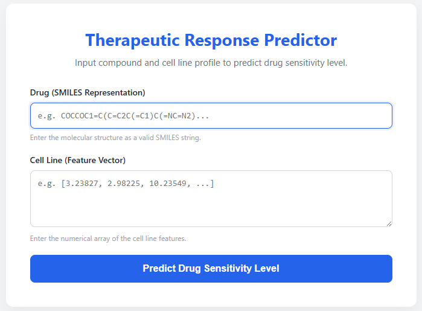

# Therapeutic Response Predictor

## 📖 Overview
This application is an end-to-end web-based machine learning tool designed to predict how a specific biological cell line will react to a specific chemical compound. 

It takes a drug's chemical structure (represented as a SMILES string) and a cell line's biological profile (a transcriptomic/feature vector array), processes them, and uses a pre-trained Random Forest machine learning model to predict a "Sensitivity Level" score in real-time.

### How It Works:
1. **User Input:** The user provides a SMILES string and a numerical array representing the cell line via the web interface.
2. **Feature Extraction:** The Flask backend uses **RDKit** to convert the SMILES string into a 1024-bit Morgan Fingerprint.
3. **Prediction:** The drug fingerprint and cell line array are combined and fed into the trained **Random Forest Regressor** (`rf_model.pkl`).
4. **Result:** The predicted Sensitivity Level is sent back to the frontend and displayed to the user.

---

## 🔬 Value in Therapeutics
For researchers, pharmacologists, and computational biologists, this tool serves as a powerful **in-silico (computer-based) screening platform**:

* **Accelerated Drug Discovery:** Virtually screen thousands of compounds against target cell lines before moving to expensive and time-consuming *in vitro* or *in vivo* testing.
* **Precision Medicine:** Input transcriptomic data from specific patient tumors to predict which existing drugs will be most effective for that individual.
* **Cost Reduction:** Filter out drugs highly likely to fail early in the research pipeline.
* **Drug Repurposing:** Test already-approved drugs against new, unstudied cell lines to identify new treatment opportunities.

---

## 📂 Project Structure
Ensure your project files are organized exactly like this for the Flask application to run correctly:

```text
my_project/
│
├── app.py                  # The Flask Python backend
├── rf_model.pkl            # The saved Random Forest model
└── templates/
    └── index.html          # The frontend UI (HTML/CSS/JS)


